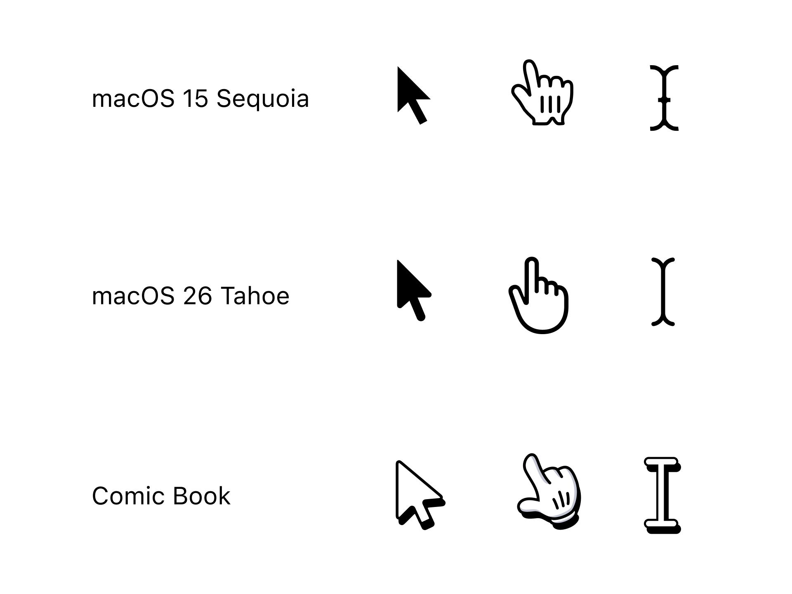

# Big bold beautiful comic book-style cursors for macOS

- Larger, easier to see.
- Better arrow proportions.
- Perfectly symmetrical.
- Angled pointer hand—less striking change on hover.

Download [from Releases](https://github.com/tonsky/macos-cursors-comic-book/releases/latest/download/ComicBook_cape.zip).

To be used with [Mousesape](https://github.com/alexzielenski/Mousecape). For Tahoe/Golden Gate, [Mousecape-swiftUI](https://github.com/sdmj76/Mousecape-swiftUI) worked for me.